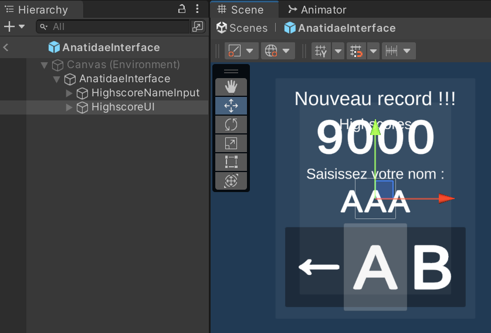
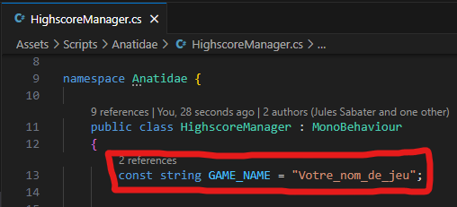

# Anatidae Toolkit

Anatidae Toolkit contient tous les éléments nécessaires pour créer un jeu compatible avec la borne d'arcade MMI grâce au moteur Unity.

## 0. Contenu du toolkit

Ce repo contient les éléments pour démarrer un projet compatible Anatidae ou pour ajouter les fonctionnalités Anatidae à un jeu existant :

- **Un projet Unity** configuré pour créer un jeu compatible avec Anatidae
- **Anatidae_toolkit.unitypackage** (onglet Releases) : Pour rendre un jeu Unity existant compatible avec la borne (de la configuration supplémentaire sera nécessaire, c.f [**3. Anatidae Toolkit pour Unity**](#3-anatidae-toolkit-pour-unity)).

## 1. Fonctionnement de Anatidae

Anatidae est une interface qui permet de sélectionner des jeux WebGL stockés dans un dossier, ainsi que de stocker des informations supplémentaires au jeu à l'aide de l'[API](#4-anatidae-api). Son code source est disponible ici : [**anatidae-arcade**](https://github.com/XariusExcl/anatidae-arcade)

## 2. Anatidae Toolkit pour Unity

### Input

Le toolkit actuel utilise l’ancien Input Manager. Des axes et des boutons sont créés pour correspondre aux contrôleurs de la borne.

Si vous utilisez le .unitypackage pour rendre compatible un jeu existant, remplacez le fichier `InputManager.asset` du dossier `ProjectSettings/` de votre projet existant par celui téléchargé.

Dans le projet exemple, les boutons et axes sont attribués aux touches du clavier suivantes :


| Type | Nom |
|:---:|-----|
| Axes | P1_Vertical, P1_Horizontal, P2_Vertical, P2_Horizontal |
| Boutons | P1_Start, P1_B1, P1_B2, P1_B3, P1_B4, P1_B5, P1_B6, P2_Start, P2_B1, P2_B2, P2_B3, P2_B4, P2_B5, P2_B6, Coin|

Pour les utiliser dans vos scripts, vous pouvez écrire `Input.GetAxis("P1_Horizontal")` ou `Input.GetButtonDown("P2_B4")` par exemple.

### Prefab AnatidaeInterface

Le prefab AnatidaeInterface doit se trouver dans chaque scène de votre jeu. Il contient différents GameObjects :

- `HighscoreNameInput` Est le menu de saisie d’un highscore par le joueur.
- `HighscoreUI` Est l’écran d’affichage des highscores existants. Les highscores affichés utilisent le prefab `HighscoreEntry`.

Vous pouvez modifier l’esthétique de ces objets librement.



### Anatidae namespace (C#)

Tous les scripts du package sont dans un namespace appelé `Anatidae`, que vous pouvez importer dans vos scripts avec `using Anatidae;`, ou les utiliser directement en préfixant les méthodes et champs par `Anatidae.` .

La gestion des highscores est faite par `HighscoreManager`.  Cette classe gère également l’affichage des différents menus intégrés au toolkit (`HighscoreUI` et `HighscoreNameInput`).

Il est également nécessaire d'assigner la variable `GAME_NAME` de `HighscoreManager` avec le nom de votre jeu (sans espaces ni accents). Ce nom doit être le même nom que le dossier qui contiendra votre Build.



Voici les différentes méthodes utilisables dans vos scripts :

**Méthodes :**

- `bool Anatidae.HighscoreManager.IsHighscore(string name, int score)`
    - Retourne `true` si le record est un highscore pour le joueur `name`.
- `bool Anatidae.HighscoreManager.IsHighscore(int score)`
    - Retourne `true` si le record est dans le top 10 de la borne.
- `void Anatidae.HighscoreManager.ShowHighscoreInput()`
    - Affiche l'écran de saisie de nom pour un highscore. Le score s'envoie après la saisie de "END" et le menu se ferme automatiquement.
- `IEnumerator Anatidae.HighscoreManager.SetHighscore(string name, int score)`
    - Méthode asynchrone qui permet d’envoyer un score à la borne sans passer par le menu `HighscoreNameInput`.
- `IEnumerator Anatidae.HighscoreManager.FetchHighscores()`
    - Méthode asynchrone pour récupérer les highscores de la borne sans passer par `HighscoreUI`.

**Champs :**

- `bool Anatidae.HighscoreManager.IsHighscoreInputScreenShown`
    - Retourne `true` si le menu HighscoreNameInput est visible. Sert à bloquer l'interaction de vos menus lorsque le joueur saisit son pseudo.
- `string Anatidae.HighscoreManager.PlayerName`
    - Le nom que le joueur a saisi. Permet d’envoyer un record sans faire saisir à nouveau le nom du joueur.

### Exemples

Supposons que le joueur vient de terminer sa partie. Nous n’avons pas encore son pseudo, mais avant d’afficher `HighscoreInputManager` pour qu'il puisse le saisir, nous pouvons vérifier si ce score sera affiché ou non sur la borne (c’est-à-dire, s’il est dans le top 10 ou non).

Nous pouvons donc écrire une méthode comme ceci :

```csharp
if (Anatidae.HighscoreManager.IsHighscore(score))
{
  Anatidae.HighscoreManager.ShowHighscoreInput(score);
}
```

Le prefab s’occupera d’envoyer le score avec le pseudo saisi (stocké ensuite dans `Anatidae.HighscoreManager.PlayerName`) et de se fermer automatiquement lorsque l’envoi est réussi.

Maintenant, supposons que le joueur termine sa partie avec un nouveau record personnel et a déjà saisi son nom précédemment. Vous pouvez choisir d’envoyer le nouveau record sans afficher le menu de saisie de pseudo.

Vous pouvez ajouter cette fonctionnalité au code précédent comme ceci :

```csharp
if (Anatidae.HighscoreManager.IsHighscore(score))
{
  if (Anatidae.HighscoreManager.PlayerName == null) { // Vérifier si le joueur a saisi un pseudo ou non
    Anatidae.HighscoreManager.ShowHighscoreInput(score); // Lui afficher le menu de saisie de pseudo
  }
  else {
    // Enregistrer directement un nouveau record avec le pseudo précédemment saisi
    StartCoroutine(Anatidae.HighscoreManager.SetHighscore(Anatidae.HighscoreManager.PlayerName, score)); 
  }
}
```
